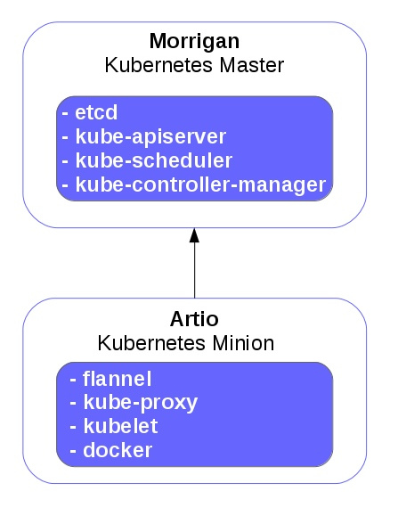

[Index](1-Portada.md) - [Anterior](1-Portada.md) | [Siguiente](3-Kube_HA_pcs.md)

---------------------------------

Kubernetes simple (1 Master y 1 Minion)
=======================================

Escenario
---------

* Infraestructura Kubernetes HA

| Nombre 			| Función 				| IP externa		| IP interna	|
|-------------------|-----------------------|-------------------|---------------|
| **Morrigan**		| Kubernetes master 1	| 172.22.205.240	| 10.0.0.43 	|
| **Artio**			| Kubernetes minion 1	| 172.22.205.242	| 10.0.0.45 	|

Esquema de funcionamiento
-------------------------

Configuración previa
--------------------

##### Configuración de nombres

	echo "10.0.0.43	 morrigan
	10.0.0.45	 artio" >> /etc/hosts

##### Repositorios (Masters y minions)
	
	sudo yum install epel-release

	sudo nano /etc/yum.repos.d/virt7-docker-common-release.repo
	[virt7-docker-common-release]
	name=virt7-docker-common-release
	baseurl=http://cbs.centos.org/repos/virt7-docker-common-release/x86_64/os/
	gpgcheck=0

	sudo yum -y install --enablerepo=virt7-docker-common-release kubernetes

Instalación
-----------

* Master

		yum -y install etcd kubernetes

* Minion
		
		yum -y install flannel kubernetes

Configuración
-------------

#### Configuración Kubernetes (Master y minion)

Editamos `/etc/kubernetes/config`

	KUBE_ETCD_SERVERS="--etcd-servers=http://morrigan:2379"
	KUBE_LOGTOSTDERR="--logtostderr=true"
	KUBE_LOG_LEVEL="--v=0"
	KUBE_ALLOW_PRIV="--allow-privileged=true"
	KUBE_MASTER="--master=http://morrigan:8080"

#### Configuración Apiserver (Master)

Editamos `/etc/kubernetes/apiserver`

	KUBE_API_ADDRESS="--address=0.0.0.0"
	KUBE_API_PORT="--port=8080"
	KUBE_MASTER="--master=http://morrigan:8080"
	KUBELET_PORT="--kubelet-port=10250"
	KUBE_ETCD_SERVERS="--etcd-servers=http://morrigan:2379"
	KUBE_SERVICE_ADDRESSES="--service-cluster-ip-range=10.254.0.0/16"
	KUBE_ADMISSION_CONTROL="--admission-control=NamespaceLifecycle,NamespaceExists,LimitRanger,SecurityContextDeny,ServiceAccount,ResourceQuota"
	KUBE_API_ARGS=""

Habilitamos y ejecutamos las siguientes unidades

	for SERVICES in etcd kube-apiserver kube-controller-manager kube-scheduler; do 
		systemctl restart $SERVICES
		systemctl enable $SERVICES
		systemctl status $SERVICES 
	done

#### Configuración Kubelet (Minion)

Editamos `/etc/kubernetes/kubelet`

	KUBELET_ADDRESS="--address=0.0.0.0"
	KUBELET_PORT="--port=10250"
	KUBELET_HOSTNAME="--hostname-override=artio"
	KUBELET_API_SERVER="--api-servers=http://morrigan:8080"
	KUBELET_ARGS=""

Habilitamos y ejecutamos las siguientes unidades

	for SERVICES in kube-proxy kubelet docker; do 
	    systemctl restart $SERVICES
	    systemctl enable $SERVICES
	    systemctl status $SERVICES 
	done

Podemos comprobar el estado del minion Artio con

`kubectl get nodes`

	NAME            LABELS                                  STATUS    AGE
	artio 	  kubernetes.io/hostname=artio  				Ready     1m

---------------------------------

[Anterior](1-Portada.md) | [Siguiente](3-Kube_HA_pcs.md)
