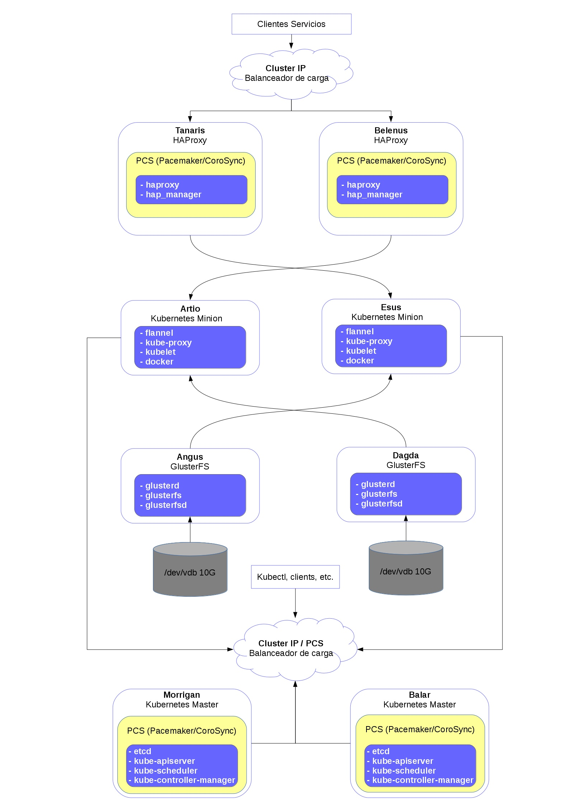

 
 <ul>
  <li><a class="bar" href="1-Portada.md">Home</a></li>
  <li><a class="bar" href="2-Kube_simple.md">Kubernetes Simple</a></li>
  <li><a class="active" href="3-Kube_HA_pcs.md">Kubernetes HA</a></li>
  <li><a class="bar" href="4-Addons.md">Addons</a></li>
  <li><a class="bar" href="5-Exponer_svc.md">Exponer servicios</a></li>
  <li><a class="bar" href="6-Almacenamiento.md">Almacenamiento persistente</a></li>
  <li><a class="bar" href="7-Explotando_kubernetes.md">Utilización</a></li>
  <li><a class="bar" href="8-Kubernetes_ansible.md">Kubernetes y Ansible</a></li>
  <li><a class="bar" href="9-ElasticKube.md">ElasticKube</a></li>
  <li><a class="bar" href="10-Conclusion.md">Conclusión</a></li>
  <li style="float:bottom"><a class="bar" href="Contacto.md">Contacto</a></li>
</ul>

 
 <ul>
  <li><a class="next" href="2-Kube_simple.md">Anterior</a></li>
  <li style="float:right"><a class="next" href="4-Addons.md">Siguiente</a></li>
</ul>

Cluster Kubernetes HA (2 masters y 2 minions)
=============================================

[Agradecimientos a Scott Collier](https://twitter.com/collier_s)

[Contenidos](#indice)
-------------------

1. [Escenario](#escenario)
2. [Configuración previa](#previo)
3. [Instalación](#instalacion)
4. [Configuración](#configuracion)
	* [Configuración de Etcd](#conf-etcd)
	* [Configuración de Flannel](#conf-flannel)
	* [Configuración de APIServer](#conf-apiserver)
	* [Configuración de PCS](#conf-pcs)
		* [Configuración de recursos](#conf-pcs-resources)
			* [Configuración de Cluster IP](#conf-pcs-ip)
			* [Configuración de recursos de Kubernetes](#conf-pcs-kubernetes)
5. [Ajustes finales](#ajustes-finales)
6. [Pruebas de funcionamiento](#pruebas)
7. [Siguientes pasos](#next-step)

Enlaces de interes
------------------

http://kubernetes.io/docs/user-guide/debugging-pods-and-replication-controllers/

Escenario
---------

### Infraestructura Kubernetes HA

| Nombre 			| Función 				| Numero	| IP externa		| IP interna	|
|-------------------|-----------------------|-----------|-------------------|---------------|
| **Taranis**		| Proxy 				| 1			| 172.22.205.244	| 10.0.0.48 	|
| **Belenus**		| Proxy 				| 2			| 172.22.205.247	| 10.0.0.53		|
| **Morrigan**		| KMaster 				| 1			| 172.22.205.240	| 10.0.0.43 	|
| **Balar**			| KMaster 			 	| 2			| 172.22.205.241	| 10.0.0.44 	|
| **Artio**			| KMinion			 	| 1			| 172.22.205.242	| 10.0.0.45 	|
| **Esus**			| KMinion 				| 2			| 172.22.205.243	| 10.0.0.46 	|
| **Angus**			| Almacenamiento		| 1			| 172.22.205.245	| 10.0.0.52		|
| **Dagda**			| Almacenamiento		| 2			| 172.22.205.246	| 10.0.0.50		|

### VIP con CLusterIP

| IP subnet	(VIP)	| IP Flotante 			| Servicio						|
|-------------------|-----------------------|-------------------------------|
| 10.0.0.38 		| 172.22.205.248 		| Entrada a HAProxy dinamico	|
| 10.0.0.39 		| 172.22.205.249 		| API Kubernetes masters 		|

Esquema de funcionamiento
-------------------------

Configuración previa
--------------------

##### Configuración de nombres

	echo "# Celtas Kubernetes
	10.0.0.43 morrigan
	10.0.0.44 balar
	10.0.0.45 artio
	10.0.0.46 esus
	10.0.0.52 angus
	10.0.0.50 dagda
	10.0.0.48 tanaris
	10.0.0.53 belenus" >> /etc/hosts

##### Repositorios (Masters y minions)

	sudo yum install epel-release

	echo "[virt7-docker-common-release]
	name=virt7-docker-common-release
	baseurl=http://cbs.centos.org/repos/virt7-docker-common-release/x86_64/os/
	gpgcheck=0" > /etc/yum.repos.d/virt7-docker-common-release.repo

##### NTP para los nodos master

Instalación

	yum install ntp ntpdate ntp-doc

Configuración

	chkconfig ntpd on

	ntpdate pool.ntp.org

Editamos `/etc/ntp.conf`

	server 0.centos.pool.ntp.org iburst
	server 1.centos.pool.ntp.org iburst
	server 2.centos.pool.ntp.org iburst
	server 3.centos.pool.ntp.org iburst
	server 0.rhel.pool.ntp.org
	server 1.rhel.pool.ntp.org
	server 2.rhel.pool.ntp.org

Reiniciamos ntp

	systemctl restart ntpd

Instalación
-----------

* Masters

		yum -y install etcd kubernetes-master pcs fence-agents-all

* Minions

		yum -y install kubernetes-node docker flannel

Versión instalada

	[root@morrigan]# yum list installed | grep kube
	kubernetes-client.x86_64               1.2.0-0.9.alpha1.gitb57e8bd.el7 @extras  
	kubernetes-master.x86_64               1.2.0-0.9.alpha1.gitb57e8bd.el7 @extras

Configuración
-------------

Componentes que vamos a configurar a continuación:

* Etcd
* Flannel
* Apiserver

#### Configuración de etcd

Cambios en `/etc/etcd/etcd.conf`

* Morrigan

		ETCD_NAME=etcd0
		ETCD_LISTEN_PEER_URLS="http://0.0.0.0:2380"
		ETCD_LISTEN_CLIENT_URLS="http://0.0.0.0:2379,http://0.0.0.0:4001"
		ETCD_INITIAL_ADVERTISE_PEER_URLS="http://10.0.0.43:2380"
		ETCD_INITIAL_CLUSTER="etcd0=http://10.0.0.43:2380,etcd1=http://10.0.0.44:2380"
		ETCD_INITIAL_CLUSTER_STATE="new"
		ETCD_INITIAL_CLUSTER_TOKEN="etcd-cluster"
		ETCD_ADVERTISE_CLIENT_URLS="http://10.0.0.43:2379"

* Balar

		ETCD_NAME=etcd1
		ETCD_LISTEN_PEER_URLS="http://0.0.0.0:2380"
		ETCD_LISTEN_CLIENT_URLS="http://0.0.0.0:2379,http://0.0.0.0:4001"
		ETCD_INITIAL_ADVERTISE_PEER_URLS="http://10.0.0.44:2380"
		ETCD_INITIAL_CLUSTER="etcd0=http://10.0.0.43:2380,etcd1=http://10.0.0.44:2380"
		ETCD_INITIAL_CLUSTER_STATE="new"
		ETCD_INITIAL_CLUSTER_TOKEN="etcd-cluster"
		ETCD_ADVERTISE_CLIENT_URLS="http://10.0.0.44:2379"

Habilitamos etcd y lo arrancamos (Masters)

	systemctl enable etcd; systemctl start etcd; systemctl status etcd

* Podemos ver el estado del cluster etcd con:

		[root@morrigan ~]# etcdctl cluster-health; etcdctl member list
		member 3a1e52dab64d52d1 is healthy: got healthy result from http://10.0.0.44:2379
		member 615bbac592673ecc is healthy: got healthy result from http://10.0.0.43:2379
		cluster is healthy
		3a1e52dab64d52d1: name=etcd1 peerURLs=http://10.0.0.44:2380 clientURLs=http://10.0.0.44:2379
		615bbac592673ecc: name=etcd0 peerURLs=http://10.0.0.43:2380 clientURLs=http://10.0.0.43:2379

#### Configuración de red Flannel

Definimos la red flannel para el cluster (Morrigan)

	etcdctl mk /atomic.io/network/config '{"Network":"10.80.0.0/16"}'

Definimos la red de flannel (Minions) `/etc/sysconfig/flanneld`
	
	FLANNEL_ETCD="http://10.0.0.43:2379,http://10.0.0.44:2379"

Habilitamos y arrancamos Flanneld y Docker (Minions)

	systemctl enable flanneld; systemctl restart flanneld; systemctl status flanneld
	systemctl enable docker; systemctl restart docker; systemctl status docker

#### Configuración de Kubernetes Apiserver

* Masters - Editamos `/etc/kubernetes/apiserver`
	
		KUBE_API_ADDRESS="--address=0.0.0.0"
		KUBE_API_PORT="--port=8080"
		KUBELET_PORT="--kubelet_port=10250"
		KUBE_ETCD_SERVERS="--etcd_servers=http://10.0.0.43:2379,http://10.0.0.44:2379"
		KUBE_SERVICE_ADDRESSES="--service-cluster-ip-range=10.254.0.0/16"
		KUBE_ADMISSION_CONTROL="--admission_control=NamespaceLifecycle,NamespaceExists,LimitRanger,SecurityContextDeny,ResourceQuota"
		KUBE_API_ARGS=""

* Minions
	
	* Editamos `/etc/kubernetes/config`

			KUBE_MASTER="--master=http://10.0.0.39:8080"
			KUBE_ALLOW_PRIV="--allow-privileged=true"

	* Editamos `/etc/kubernetes/kubelet`

		* Artio

				KUBELET_ADDRESS="--address=0.0.0.0"
				KUBELET_PORT="--port=10250"
				# KUBELET_HOSTNAME="--hostname_override=IP_MINION"
				#KUBELET_HOSTNAME="--hostname_override=10.0.0.45"
				KUBELET_HOSTNAME="--hostname-override=artio"
				KUBELET_API_SERVER="--api-servers=http://10.0.0.39:8080"
				KUBELET_ARGS="--register-node=true"

		* Esus

				KUBELET_ADDRESS="--address=0.0.0.0"
				KUBELET_PORT="--port=10250"
				#KUBELET_HOSTNAME="--hostname_override=10.0.0.46"
				KUBELET_HOSTNAME="--hostname-override=esus"
				KUBELET_API_SERVER="--api-servers=http://10.0.0.39:8080"
				KUBELET_ARGS="--register-node=true"

#### Ajuste de unidades

* Minions

		systemctl restart kube-proxy; systemctl enable kube-proxy; systemctl restart kubelet; systemctl enable kubelet; systemctl restart docker; systemctl enable docker; systemctl restart flanneld; systemctl enable flanneld

#### Configuración PCS

Configuramos el cluster (Morrigan)

	pcs cluster setup --name PCS-HA-Kubernetes morrigan balar

Iniciamos el cluster y lo habilitamos

	pcs cluster start --all
	pcs cluster enable --all

Podemos ver el estado actual con

	[root@morrigan centos]# pcs status
	Cluster name: PCS-HA-Kubernetes
	Last updated: Tue Apr 26 09:22:29 1993		Last change: Tue Apr 26 09:22:26 1993 by root via cibadmin on morrigan
	Stack: corosync
	Current DC: balar (version 1.1.13-10.el7_2.2-44eb2dd) - partition with quorum
	2 nodes and 0 resources configured

	Online: [ balar morrigan ]

	Full list of resources:

	PCSD Status:
  		morrigan: Online
  		balar: Online

	Daemon Status:
  		corosync: active/enabled
  		pacemaker: active/enabled
  		pcsd: active/enabled

##### Configuración de recursos en PCS

###### Cluster IP con PCS

Añadimos un recurso cluster con la ip fija reservada a la vip.
		
	pcs resource create ClusterIP ocf:heartbeat:IPaddr2 \
     ip=10.0.0.39 cidr_netmask=24 op monitor interval=30s

Clonamos el recurso para que este en los dos nodos
    	
    	pcs resource clone ClusterIP \
     	 globally-unique=true clone-max=2 clone-node-max=2

Comprobamos el recurso

	[root@morrigan centos]# pcs resource show
 	Clone Set: ClusterIP-clone [ClusterIP] (unique)
     ClusterIP:0	(ocf::heartbeat:IPaddr2):	Started balar
     ClusterIP:1	(ocf::heartbeat:IPaddr2):	Started morrigan

###### Cluster con recursos de Kubernetes

Creamos los siguientes recursos para que pcs controle Kubernetes

	pcs resource create APIServer systemd:kube-apiserver master-max=2 --group kubernetes-master
	pcs resource create Scheduler systemd:kube-scheduler master-max=2 --group kubernetes-master
	pcs resource create Controller systemd:kube-controller-manager master-max=2 --group kubernetes-master

Comprobamos el estado

	[root@morrigan centos]# pcs resource show
	 Resource Group: kubernetes-master
     	APIServer	(systemd:kube-apiserver):	Started balar
     	Scheduler	(systemd:kube-scheduler):	Started balar
     	Controller	(systemd:kube-controller-manager):	Started balar

Podemos clonar los recursos de dos formas diferentes:

* Modo 1 por recurso

		pcs resource clone ClusterIP \
	     globally-unique=true clone-max=2 clone-node-max=2
		pcs resource clone APIServer --group master
		pcs resource clone Scheduler --group master
		pcs resource clone Controller --group master

* Modo 2 por grupo

		pcs resource clone kubernetes-master

Comprobamos los recursos

* Modo 1

		[root@morrigan centos]# pcs resource show
		 Clone Set: ClusterIP-clone [ClusterIP] (unique)
		     ClusterIP:0	(ocf::heartbeat:IPaddr2):	Started balar
		     ClusterIP:1	(ocf::heartbeat:IPaddr2):	Started morrigan
		 Clone Set: APIServer-clone [APIServer]
		     Started: [ balar morrigan ]
		 Clone Set: Scheduler-clone [Scheduler]
		     Started: [ balar morrigan ]
		 Clone Set: Controller-clone [Controller]
		     Started: [ balar morrigan ]

* Modo 2

		 Clone Set: ClusterIP-clone [ClusterIP] (unique)
		     ClusterIP:0        (ocf::heartbeat:IPaddr2):	Started balar
		     ClusterIP:1        (ocf::heartbeat:IPaddr2):	Started morrigan
		 Clone Set: kubernetes-master-clone [kubernetes-master]
		     Started: [ balar morrigan ]

Ajustes finales
---------------

#### Ajustes de Kubectl

Si ejecutamos el siguiente comando el los nodos del cluster, podemos observar que nos responde con los minions de Kubernetes

	kubectl get nodes

Respuesta

	NAME      LABELS                         STATUS    AGE
	artio     kubernetes.io/hostname=artio   Ready     18h
	esus      kubernetes.io/hostname=esus    Ready     18h

Sin embarco en los minions este comando nos pasara el siguiente error

	The connection to the server localhost:8080 was refused - did you specify the right host or port?

Para poder acceder desde los minions podemos ejecutar el comando de la siguiente forma

1. Con la IP del cluster

		kubectl -s http://10.0.0.39:8080 get nodes 

2. Definiendo el cluster

		kubectl config set-cluster test-cluster --server=http://10.0.0.39:8080
		kubectl config set-context test-cluster --cluster=test-cluster
		kubectl config use-context test-cluster

#### Ajustes de ClusterIP

Colocación de ClusterIP: [Test Failover](http://clusterlabs.org/doc/en-US/Pacemaker/1.1/html/Clusters_from_Scratch/_test_failover.html)
Cuando uno de los nodos falla y vuelve a levantarse el recurso ClusterIP permanece en en nodo que no se fallo por lo que no esta balanceado. Solo modo 2.

	Online: [ balar morrigan ]

	Full list of resources:

	 Clone Set: ClusterIP-clone [ClusterIP] (unique)
	     ClusterIP:0	(ocf::heartbeat:IPaddr2):	Started morrigan
	     ClusterIP:1	(ocf::heartbeat:IPaddr2):	Started morrigan
	 Clone Set: APIServer-clone [APIServer]
	     Started: [ balar morrigan ]
	 Clone Set: Scheduler-clone [Scheduler]
	     Started: [ balar morrigan ]
	 Clone Set: Controller-clone [Controller]
	     Started: [ balar morrigan ]

Para que el recurso vuelva a los dos nodos para estar balanceado, desactivamos: stickiness.

	pcs resource meta ClusterIP resource-stickiness=0

El resultado sera el siguiente

	Online: [ balar morrigan ]

	Full list of resources:

	 Clone Set: ClusterIP-clone [ClusterIP] (unique)
	     ClusterIP:0	(ocf::heartbeat:IPaddr2):	Started morrigan
	     ClusterIP:1	(ocf::heartbeat:IPaddr2):	Started balar
	 Clone Set: APIServer-clone [APIServer]
	     Started: [ balar morrigan ]
	 Clone Set: Scheduler-clone [Scheduler]
	     Started: [ balar morrigan ]
	 Clone Set: Controller-clone [Controller]
	     Started: [ balar morrigan ]

#### Solución de errores adicionales

**ERROR:** *No API token found for service account default/default, retry after the token is automatically created and added to the service account*

* Este error los puedes ver cuando vas a crear un pod directamente o cuando un rc no tiene pods.

Reportado en:

      https://github.com/kubernetes/kubernetes/issues/11355#issuecomment-127378691
      http://stackoverflow.com/questions/31891734/not-able-to-create-pod-in-kubernetes

**SOLUCION:**

Generamos serviceaccount en Morrigan

	openssl genrsa -out /tmp/serviceaccount.key 2048

Copiamos la clave privada a Balar

	scp /tmp/serviceaccount.key  root@balar:/tmp/serviceaccount.key

Configuración en ambos nodos:

`nano /etc/kubernetes/apiserver`

	KUBE_API_ARGS="--service_account_key_file=/tmp/serviceaccount.key"

`nano /etc/kubernetes/controller-manager`

	KUBE_CONTROLLER_MANAGER_ARGS="--service_account_private_key_file=/tmp/serviceaccount.key"

Pruebas de funcionamiento
-------------------------

En primer lugar ponemos en standby todos los nodos del cluster, los resultados de las pruebas son sobre el modo 1 de clonación ya que da mas información de los recursos. El modo recomendado a usar es el modo 2.
	
	pcs cluster standby --all

Los nodos del cluster quedaran de la siguiente forma

	Node balar: standby
	Node morrigan: standby

	Full list of resources:

	 Clone Set: ClusterIP-clone [ClusterIP] (unique)
	     ClusterIP:0	(ocf::heartbeat:IPaddr2):	Stopped
	     ClusterIP:1	(ocf::heartbeat:IPaddr2):	Stopped
	 Clone Set: APIServer-clone [APIServer]
	     Stopped: [ balar morrigan ]
	 Clone Set: Scheduler-clone [Scheduler]
	     Stopped: [ balar morrigan ]
	 Clone Set: Controller-clone [Controller]
	     Stopped: [ balar morrigan ]

En segundo lugar vamos sacando los nodos de stadby para comprobar su correcto funcionamiento. Activamos Morrigan y dejamos en standby Balar.

	pcs cluster unstandby morrigan

Los recursos con Morrigan activo quedaran de la siguiente forma

	Node balar: standby
	Online: [ morrigan ]

	Full list of resources:

	 Clone Set: ClusterIP-clone [ClusterIP] (unique)
	     ClusterIP:0	(ocf::heartbeat:IPaddr2):	Started morrigan
	     ClusterIP:1	(ocf::heartbeat:IPaddr2):	Started morrigan
	 Clone Set: APIServer-clone [APIServer]
	     Started: [ morrigan ]
	     Stopped: [ balar ]
	 Clone Set: Scheduler-clone [Scheduler]
	     Started: [ morrigan ]
	     Stopped: [ balar ]
	 Clone Set: Controller-clone [Controller]
	     Started: [ morrigan ]
	     Stopped: [ balar ]

Paramos Morrigan y activamos Balar

	pcs cluster unstandby balar; pcs cluster standby morrigan

Comprobamos su funcionamiento

	Node morrigan: standby
	Online: [ balar ]

	Full list of resources:

	 Clone Set: ClusterIP-clone [ClusterIP] (unique)
	     ClusterIP:0	(ocf::heartbeat:IPaddr2):	Started balar
	     ClusterIP:1	(ocf::heartbeat:IPaddr2):	Started balar
	 Clone Set: APIServer-clone [APIServer]
	     Started: [ balar ]
	     Stopped: [ morrigan ]
	 Clone Set: Scheduler-clone [Scheduler]
	     Started: [ balar ]
	     Stopped: [ morrigan ]
	 Clone Set: Controller-clone [Controller]
	     Started: [ balar ]
	     Stopped: [ morrigan ]

Paramos todos los nodos y los activamos a la vez

	pcs cluster standby --all; pcs cluster unstandby --all

Con los dos nodos activos el cluster debera quedar de la siguiente forma

	Online: [ balar morrigan ]

	Full list of resources:

	 Clone Set: ClusterIP-clone [ClusterIP] (unique)
	     ClusterIP:0        (ocf::heartbeat:IPaddr2):	Started balar
	     ClusterIP:1        (ocf::heartbeat:IPaddr2):	Started morrigan
	 Clone Set: APIServer-clone [APIServer]
	     Started: [ balar morrigan ]
	 Clone Set: Scheduler-clone [Scheduler]
	     Started: [ balar morrigan ]
	 Clone Set: Controller-clone [Controller]
	     Started: [ balar morrigan ]

#### Siguientes Pasos

Para terminar de desplegar configuramos los nodos con [HAProxy con hap_manager](5-Exponer_svc.md#hap_manager) y [GlusterFS](6-Almacenamiento.md#glusterfs).

---------------------------------

 
 <ul>
  <li><a class="next" href="2-Kube_simple.md">Anterior</a></li>
  <li style="float:right"><a class="next" href="4-Addons.md">Siguiente</a></li>
</ul>

